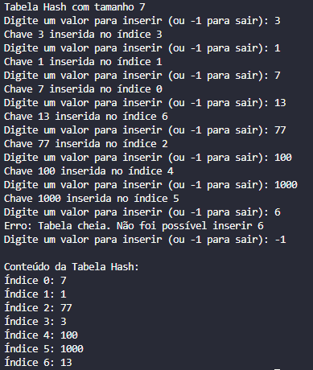

# Tabela Hash com Tratamento Linear de Colisões

## Enunciado

O objetivo dessa atividade é implementar uma tabela hash com as seguintes especificações:

1. Usar vetores de inteiros.
2. Criar uma tabela HASH com tamanho ímpar predefinido.
3. Inserir valores escolhidos pelo usuário.
4. Os valores inseridos são as chaves da tabela hash.
5. Tratar as colisões usando o método linear.

## Implementação

O código implementa uma tabela hash conforme as especificações acima:

- A classe `HashDivLinearProbe` usa um array de inteiros (`int[]`) para armazenar os dados.
- O tamanho da tabela é definido como uma constante ímpar (`TAMANHO = 7`).
- O método `inserir(int chave)` permite ao usuário adicionar valores à tabela.
- A função de hash é simples: `chave % TAMANHO`.
- Colisões são tratadas usando sondagem linear: em caso de colisão, o próximo índice é tentado sequencialmente.

### Principais Métodos

- `inserir(int chave)`: Insere uma chave na tabela hash.
- `exibirTabela()`: Mostra o conteúdo completo da tabela.
- `funcaoHash(int chave)`: Calcula o índice inicial para uma chave.

## Como Usar

1. Execute o programa.
2. Insira valores inteiros quando solicitado.
3. Digite -1 para encerrar a inserção de valores.
4. O programa exibirá a tabela hash final.

## Resultados e Testes

REF:
https://www.geeksforgeeks.org/open-addressing-collision-handling-technique-in-hashing/
https://www.tutorialspoint.com/cryptography/cryptography_hash_functions.htm
https://github.com/sohammondal/data-structures-and-algorithms/blob/master/src/ds/hash-tables/README.md
https://www.geeksforgeeks.org/introduction-to-hashing-2/
https://www.geeksforgeeks.org/hash-functions-and-list-types-of-hash-functions/