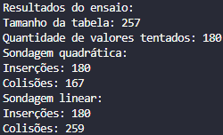
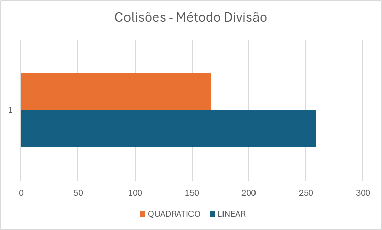

# Comparação de Métodos de Sondagem em Tabela Hash

## Descrição da Atividade

Esta atividade implementa uma tabela hash usando o método da divisão para a função hash e compara dois métodos de tratamento de colisões: sondagem quadrática e sondagem linear.

## Implementação

- Utilizei vetores de inteiros para armazenar os dados.
- A função hash utiliza o método da divisão: `chave % tamanho_tabela`.
- Foram implementados dois métodos de tratamento de colisões:
  1. Sondagem Quadrática: `(hash(chave) + i^2) % tamanho_tabela`
  2. Sondagem Linear: `(hash(chave) + i) % tamanho_tabela`

## Ensaio Comparativo

Realizei um ensaio com os seguintes parâmetros:
- Tamanho da tabela: 257 (número ímpar e primo)
- Quantidade de valores inseridos: 180 (aproximadamente 70% de ocupação)
- Valores gerados aleatoriamente entre 0 e 999999

## Resultados

1. Método da divisão com sondagem quadrática:
   - Colisões: 167

2. Método da divisão com sondagem linear:
   - Colisões: 259

## Análise dos Resultados

## Valor Estatístico do Ensaio

Este ensaio comparativo tem um valor estatístico limitado devido a:

1. **Amostra única**: Realizei apenas uma execução com um conjunto específico de dados aleatórios.
2. **Tamanho fixo**: Usei apenas um tamanho de tabela e uma quantidade fixa de inserções.
3. **Distribuição dos dados**: A distribuição dos dados gerados aleatoriamente pode não representar todos os cenários possíveis.

Para termos um valor estatístico mais significativo, seria necessário:

- Realizar múltiplas execuções com diferentes conjuntos de dados aleatórios. (Calculando média, desvio padrão, validar outliers)
- Variar o tamanho da tabela e a quantidade de inserções.
- Analisar o desempenho com diferentes taxas de ocupação da tabela.
- Considerar diferentes distribuições de dados de entrada.

Apesar dessas limitações, o ensaio nós dá uma visão inicial sobre o desempenho relativo dos dois métodos de sondagem para esse cenário específico.

REF:
https://www.geeksforgeeks.org/open-addressing-collision-handling-technique-in-hashing/
https://www.geeksforgeeks.org/quadratic-probing-in-hashing/
https://www.tutorialspoint.com/cryptography/cryptography_hash_functions.htm
https://github.com/sohammondal/data-structures-and-algorithms/blob/master/src/ds/hash-tables/README.md
https://www.geeksforgeeks.org/introduction-to-hashing-2/
https://www.geeksforgeeks.org/hash-functions-and-list-types-of-hash-functions/