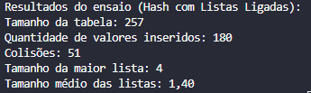
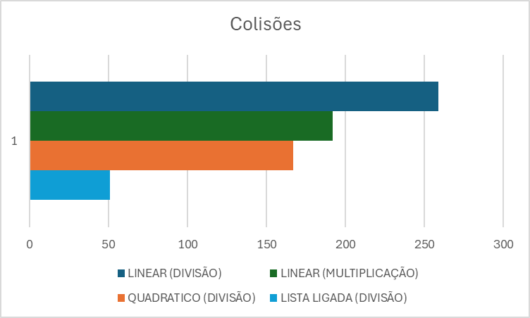

# Tabela Hash com Listas Ligadas para Tratamento de Colisões

## Descrição da Atividade

Esta atividade implementa uma tabela hash usando o método da divisão para a função hash, onde as colisões são tratadas usando listas ligadas. O objetivo é comparar este método com as implementações anteriores que usavam sondagem linear e quadrática.

## Implementação

- Utilizamos um vetor de listas ligadas para armazenar os dados.
- As chaves são valores inteiros.
- Método de hash: divisão (`chave % tamanho_tabela`)
- Tratamento de colisões: listas ligadas

### Parâmetros do Ensaio

- Tamanho da tabela: 257 (número ímpar e primo)
- Quantidade de valores inseridos: 180 (aproximadamente 70% de ocupação)
- Valores gerados aleatoriamente entre 0 e 999999
- Semente aleatória fixa (42) para garantir reprodutibilidade

## Resultados

- Total de inserções: 180
- Número de colisões: 51
- Tamanho máximo de lista ligada: 4
- Tamanho médio das listas ligadas: 1,40

## Comparação com Métodos Anteriores

| Método                                   | Colisões |
|------------------------------------------|----------|
| Divisão com sondagem quadrática          | 167      |
| Divisão com sondagem linear              | 259      |
| Multiplicação com sondagem linear        | 192      |
| Divisão com listas ligadas               | 51       |

## Análise dos Resultados

1. **Número de Colisões**: O método de listas ligadas apresentou significativamente menos colisões (51) em comparação com os métodos de sondagem. Isso se deve ao fato de que cada colisão não gera novas tentativas de inserção, mas simplesmente adiciona o elemento à lista existente.

2. **Eficiência de Espaço**: Embora o número de colisões seja menor, cada colisão resulta na criação de um novo nó na lista ligada, o que pode consumir mais memória do que os métodos de sondagem em alguns casos.

3. **Distribuição dos Dados**: O tamanho máximo de lista ligada (4) e o tamanho médio (1,40) indicam uma distribuição relativamente uniforme dos dados, com poucas posições da tabela tendo listas longas.

4. **Comparação com Sondagem**: 
   - A sondagem quadrática teve 167 colisões, mais de 3 vezes o número do método de listas ligadas.
   - A sondagem linear teve 259 colisões, cerca de 5 vezes mais que as listas ligadas.
   - O método da multiplicação com sondagem linear teve 192 colisões, quase 4 vezes mais que as listas ligadas.

5. **Impacto na Busca e Inserção**: 
   - Inserção: O método de listas ligadas é mais rápido para inserção, pois não precisa procurar uma nova posição em caso de colisão.
   - Busca: Para elementos que colidem, a busca pode ser mais lenta no método de listas ligadas, pois requer percorrer a lista.

## Valor Estatístico do Ensaio

Este ensaio comparativo tem um valor estatístico limitado devido a:

1. **Amostra única**: Realizei apenas uma execução com um conjunto específico de dados aleatórios.
2. **Tamanho fixo**: Usei apenas um tamanho de tabela e uma quantidade fixa de inserções.
3. **Distribuição dos dados**: A distribuição dos dados gerados aleatoriamente pode não representar todos os cenários possíveis.

Para termos um valor estatístico mais significativo, seria necessário:

- Realizar múltiplas execuções com diferentes conjuntos de dados aleatórios. (Calculando média, desvio padrão, validar outliers)
- Variar o tamanho da tabela e a quantidade de inserções.
- Analisar o desempenho com diferentes taxas de ocupação da tabela.
- Considerar diferentes distribuições de dados de entrada.

Apesar dessas limitações, o ensaio nós dá uma visão inicial sobre o desempenho relativo dos dois métodos de sondagem para esse cenário específico.

## Conclusão

1. O método de listas ligadas demonstrou ser mais eficiente em termos de número de colisões para este conjunto específico de dados.

2. A distribuição uniforme dos dados (indicada pelo tamanho máximo e médio das listas) sugere que o método da divisão fornece uma boa dispersão das chaves.

3. Vantagens do método de listas ligadas:
   - Menor número de colisões
   - Inserção mais rápida
   - Não há limite para o número de elementos que podem ser armazenados

4. Desvantagens potenciais:
   - Pode consumir mais memória devido à estrutura das listas ligadas
   - Buscas podem ser mais lentas para elementos que colidem

5. Este método seria preferível em cenários onde:
   - A inserção é mais frequente que a busca
   - A memória não é uma restrição crítica
   - A distribuição das chaves é imprevisível ou propensa a colisões

REF:
https://www.geeksforgeeks.org/open-addressing-collision-handling-technique-in-hashing/
https://www.geeksforgeeks.org/quadratic-probing-in-hashing/
https://www.tutorialspoint.com/cryptography/cryptography_hash_functions.htm
https://github.com/sohammondal/data-structures-and-algorithms/blob/master/src/ds/hash-tables/README.md
https://www.geeksforgeeks.org/introduction-to-hashing-2/
https://www.geeksforgeeks.org/hash-functions-and-list-types-of-hash-functions/