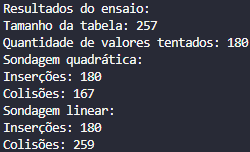
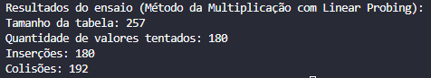
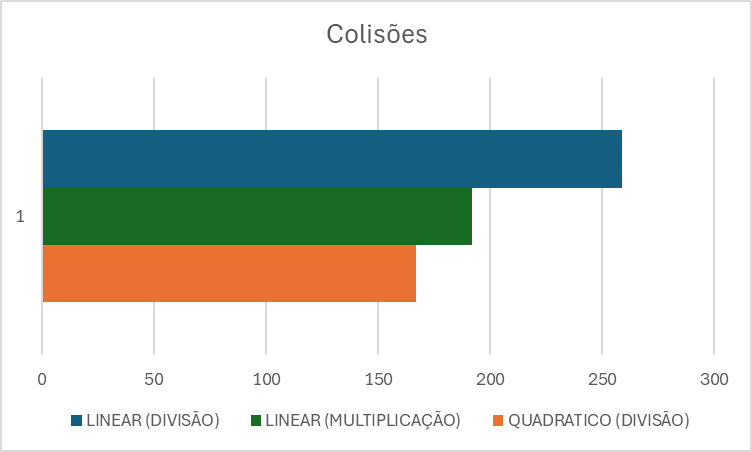

# Comparação de Métodos de Hash e Sondagem

## Descrição da Atividade

Esta atividade implementa e compara três abordagens diferentes para tabelas hash:

1. Método da divisão com sondagem quadrática
2. Método da divisão com sondagem linear
3. Método da multiplicação com sondagem linear

## Implementação

- Utilizamos vetores de inteiros para armazenar os dados em todas as implementações.
- Tamanho da tabela: 257 (número ímpar e primo)
- Quantidade de valores inseridos: 180 (aproximadamente 70% de ocupação)
- Valores gerados aleatoriamente entre 0 e 999999
- Semente aleatória fixa (42) para garantir reprodutibilidade

### Métodos de Hash

1. Método da divisão: `chave % tamanho_tabela`
2. Método da multiplicação: `(tamanho_tabela * (chave * A - floor(chave * A)))`
   onde A = (√5 - 1) / 2 ≈ 0.6180339887...

### Métodos de Sondagem

1. Sondagem Quadrática: `(hash(chave) + i^2) % tamanho_tabela`
2. Sondagem Linear: `(hash(chave) + i) % tamanho_tabela`

## Resultados

1. Método da divisão com sondagem quadrática:
   - Colisões: 167

2. Método da divisão com sondagem linear:
   - Colisões: 259

3. Método da multiplicação com sondagem linear:
   - Colisões: 192

## Análise dos Resultados

## Valor Estatístico do Ensaio

Este ensaio comparativo tem um valor estatístico limitado devido a:

1. **Amostra única**: Realizei apenas uma execução com um conjunto específico de dados aleatórios.
2. **Tamanho fixo**: Usei apenas um tamanho de tabela e uma quantidade fixa de inserções.
3. **Distribuição dos dados**: A distribuição dos dados gerados aleatoriamente pode não representar todos os cenários possíveis.

Para termos um valor estatístico mais significativo, seria necessário:

- Realizar múltiplas execuções com diferentes conjuntos de dados aleatórios. (Calculando média, desvio padrão, validar outliers)
- Variar o tamanho da tabela e a quantidade de inserções.
- Analisar o desempenho com diferentes taxas de ocupação da tabela.
- Considerar diferentes distribuições de dados de entrada.

Apesar dessas limitações, o ensaio nós dá uma visão inicial sobre o desempenho relativo dos dois métodos de sondagem para esse cenário específico.