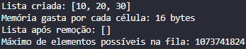

### Resultados

- **Lista criada:** [10, 20, 30]
- **Memória gasta por cada célula:** 16 bytes
- **Lista após remoção:**  []
- **Máximo de elementos possíveis na fila:** 1.073.741.824


---

Uma lista encadeada é uma representação de uma sequência de objetos, todos do mesmo tipo, na memória RAM (random access memory) do computador. Cada elemento da sequência é armazenado em uma célula da lista: o primeiro elemento na primeira célula, o segundo na segunda e assim por diante. [FEOFILOFF, 2016]

Considere as seguintes definições para implementação da lista encadeada:

```c
struct reg {
    int conteudo; 
    struct reg *prox; 
}; 
typedef struct reg celula;
```

Uma célula `c` e um ponteiro `p` para uma célula podem ser declarados assim:

```c
celula c; 
celula *p;
```

### Tarefas

1. **Criação de Instâncias**
   - Considerando a estrutura de dados `celula`, criar três instâncias do objeto célula (três valores na lista).

2. **Impressão dos Valores**
   - Construa uma função que imprima todos os valores da lista.

3. **Cálculo de Memória**
   - Calcule a quantidade de memória gasta por cada instância da célula.

4. **Remoção de Elementos**
   - Construa uma função que remove os elementos da lista.
   - Incremente sua função liberando a memória quando um elemento é removido.

5. **Máximo de Elementos**
   - Calcule o máximo de elementos possíveis na fila, considerando a memória disponível no computador.
